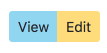

# Sassing Up Bootstrap

In this activity we will be learning how to utilize Sass in a Bootstrap project. Bootstrap's styles are written with Sass and allows you to utilize said Sass files to take advantage of variables, maps, mixins, and more. Throughout this activity you will be introduced to the major advantages of pairing Sass with Bootstrap. In order to utilize its Sass files they must either be downloaded or installed as an [_npm package_](https://www.npmjs.com/) which we'll delve into in a later module. In the meantime all npm packages will be installed and pre-configured for you.

***
- [Applying Bootstrap](#applying-bootstrap)
- [Variables](#variables)
	- [Applying Variables](#applying-variables)
	- [Modifying Variable Defaults](#modifying-variable-defaults)
		- [Customize Colours](#customize-colours)
			- [Adding Colours](#adding-colours)
		- [Customize Grid](#customize-grid)
- [Mixins](#mixins)
- [Resources](#resources)
***


## Applying Bootstrap

If we start this repositories web server and view its home page you'll find something that looks like this:

***

***

The HTML and all custom CSS are loaded for this page however Bootstrap's CSS isn't loaded. Previously we included a `bootstrap.css` file on all of our webpages but we're going to in this activity include it as an npm package via Sass. npm packages live in the `node_modules` folder that appears whenever we initially run `npm install` on a newly cloned repository. If we reference [this section](https://getbootstrap.com/docs/4.3/getting-started/theming/#file-structure) of Bootstrap's documentation, what you find within your `node_modules` folder should match what's documented.

In the [next section](https://getbootstrap.com/docs/4.3/getting-started/theming/#importing) of the documentation we can see how we can use Sass's `@import` feature we learned about in the previous module. Go ahead and include all of Bootstrap <small>(Option A)</small>. When complete the top of your page should look like this:

***

***

If we really wanted to do all we could to reduce the payload of our webpage, we could include only the parts of Bootstrap we need as seen in "Option B". Bootstrap in it's entirety only consumes 20KB of bandwidth when sent to the web browser so it's generally not worth the development time and added development complexity to manage which pieces of Bootstrap to selectively include onto your webpage but in extreme cases can be useful.

***&mdash; [Documentation](https://getbootstrap.com/docs/4.3/getting-started/theming/#importing)***


## Variables

### Applying Variables

To keep things simple lets start by applying the colours that comes included with Bootstrap provided as Sass variables. In the grid of cards with thumbnails in them there should be two buttons for each card:

- ***View*** with a class of `btn-view`
- ***Edit*** with a class of `btn-edit`

At the bottom of `./sass/_album.scss` we can see two empty rulesets for `.btn-view` and `.btn-edit`. Reference [this documentation](https://getbootstrap.com/docs/4.3/getting-started/theming/#color) and try to figure out how to set the `background-color` of `btn-view` to the **info** colour and `btn-edit` to the **warning** colour. Reference the solution below to check your work. Make sure to check Bootstrap's [`_variables.scss`](https://github.com/twbs/bootstrap/blob/57edecbfb86cc7708023526c05ba384f8aa5d220/scss/_variables.scss#L69) file.

<details>
  <summary>Solution</summary>

  ```scss
.btn-view {
	background-color: $info;
}

.btn-edit {
	background-color: $warning;
}
  ```

</details>

When you have things working you'll notice these colours don't look very nice with our design. Lets modify the info and warning colours by changing the values of these variables.


### Customize Defaults

When Bootstrap is imported as a Sass module into your project it enables the ability to customize a lot of Bootstrap's default values. These values include [colors](https://getbootstrap.com/docs/4.3/utilities/colors/), [grid gutters columns and breakpoints](https://getbootstrap.com/docs/4.3/layout/grid/#variables), [shadow size](https://getbootstrap.com/docs/4.3/utilities/shadows/), and [spacing size](https://getbootstrap.com/docs/4.3/utilities/spacing/) to name a few. We can also add and remove colours and breakpoints too. This enables us to use Bootstrap in a manner that's far more flexible, allowing us to design and develop websites without the constraints of Bootstrap. Take a moment to read Bootstrap's documentation on variable defaults [here](https://getbootstrap.com/docs/4.3/getting-started/theming/#variable-defaults).


#### Customize Colours

Create a file `./sass/_bootstrap-config.scss` and make it the first file you `@import` in `./sass/styles.scss`. This file will be where we write all of our default overrides for Bootstrap. It's important that this file is imported prior to Bootstrap as otherwise our overrides won't be set until Bootstrap's Sass already executes and defines the variables. You can read about that behavior [here](https://getbootstrap.com/docs/4.3/getting-started/theming/#variable-defaults). In your newly created Bootstrap configuration file override:

- The ***info*** colour to `#8ed6f3`
- The ***warning*** colour to `#ffdc74`

You can check your solution below. Feel free to modify the colour values to your liking:

<details>
  <summary>Solution</summary>

  ```scss
$info: #8ed6f3;
$warning: #ffdc74;
  ```

</details>



##### Adding Colours

Bootstrap comes with a wide variety of [colors](https://getbootstrap.com/docs/4.3/getting-started/theming/#color) for various purposes. Through the use of Sass we can add additional colours. Lets add a tertiary colour. We can start by adding a new button in our hero banner:

```html
<a href="#" class="btn btn-tertiary my2">Sassy action</a>
```

Then at the top of our `_bootstrap-config.scss` we need to add to add our colour to the `$theme-colors` map. A map is a type of Sass variable that contains any number of values we put into one. Each of these values are references by a name. To add a new colour to our theme we need to add a new named value to our map by adding this to our file:

```scss
$theme-colors: (
	"tertiary": #cf649a
);
```

By adding this value to our `$theme-colors` map we now have a new class in our CSS `btn-tertiary`. Bootstrap takes the name of the theme colour and makes a `btn-` class for each one contained in the map.


#### Customize Grid

Another aspect of Bootstrap we can configure is its grid. We can even change the number of columns it has which can be of great help when you're also designing the page using a grid system. To keep things simple lets just modify the gutters. You can read up on how to do this using Bootstrap's documentation [here](https://getbootstrap.com/docs/4.3/layout/grid/#columns-and-gutters). Change the gutter width to `20px` and you should see the grid items in the card grid move closer together.

<details>
  <summary>Solution</summary>

  ```scss
$grid-gutter-width: 20px;
  ```

</details>


## Mixins

TODO


## Resources

- [**Bootstrap:** Theming](https://getbootstrap.com/docs/4.3/getting-started/theming/)
- [**Bootstrap:** Adding Colours](https://getbootstrap.com/docs/4.3/getting-started/theming/#add-to-map)
- [**Bootstrap:** Customizing the Grid](https://getbootstrap.com/docs/4.3/layout/grid/#customizing-the-grid)
- [**Sass:** Maps](https://sass-lang.com/documentation/values/maps)
